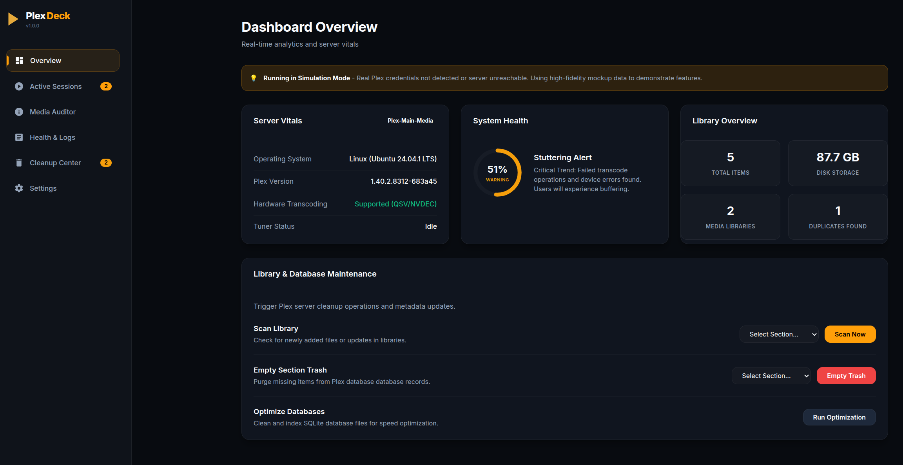
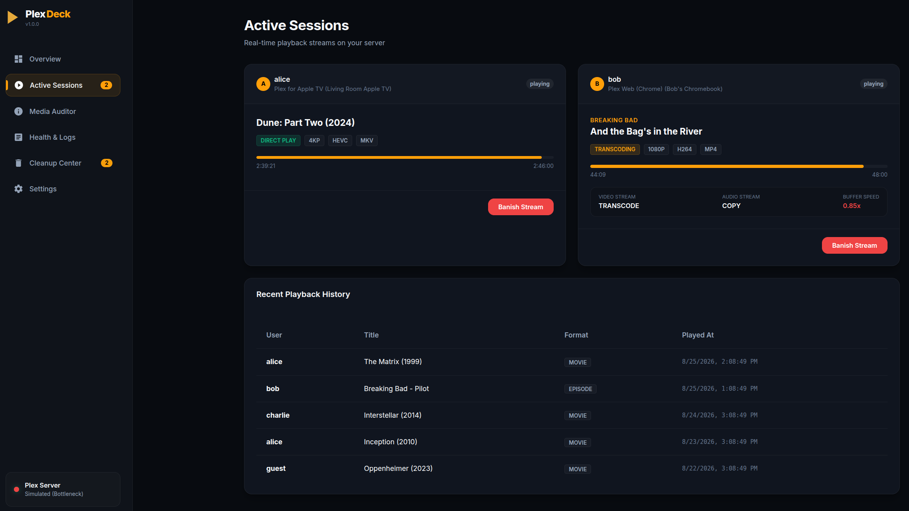
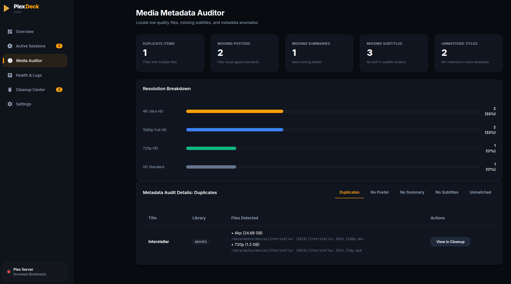
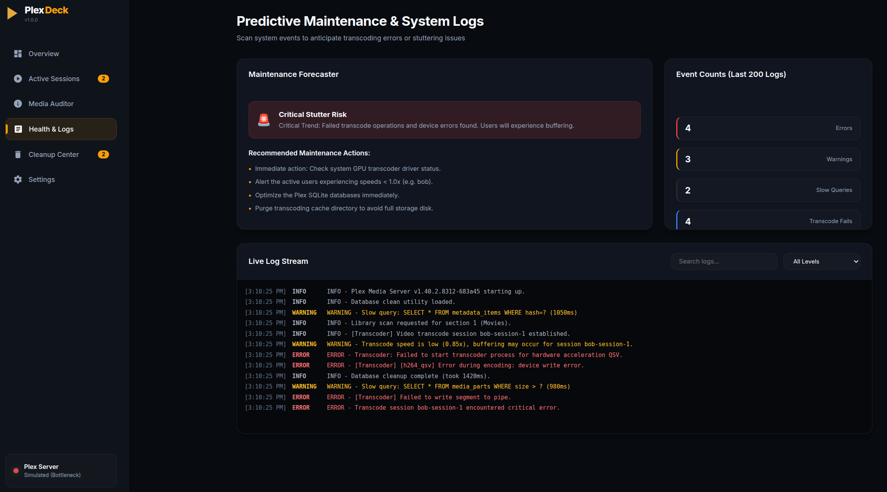
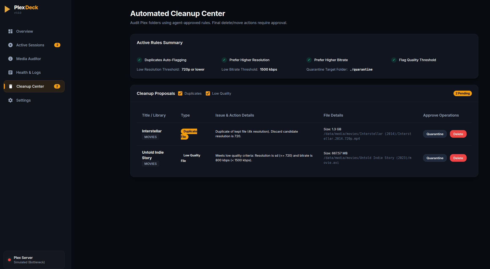
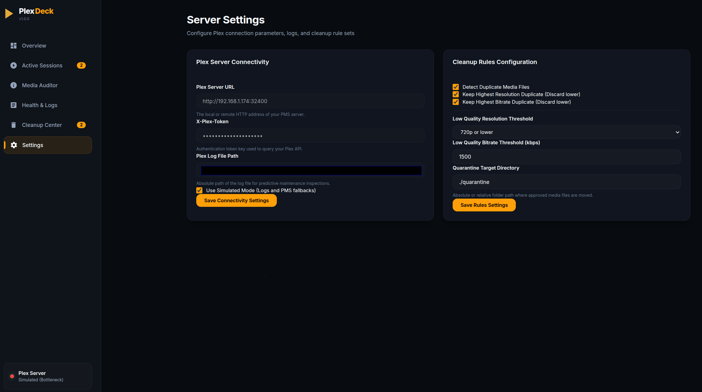
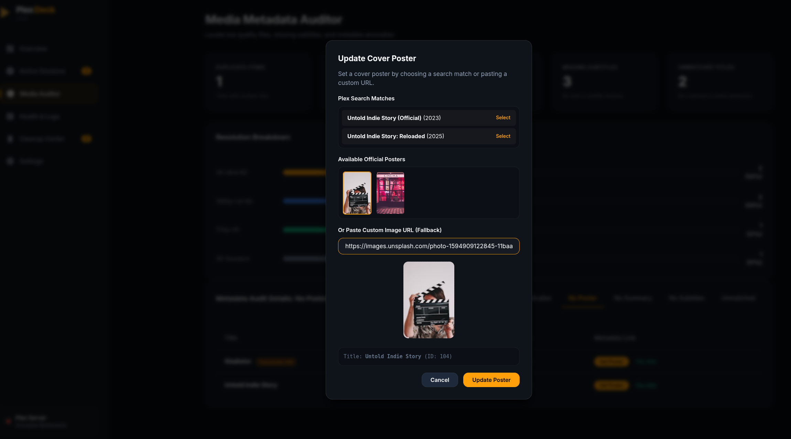

# PlexDeck 🎂

PlexDeck is a modern, responsive web dashboard and media auditor for Plex Media Server. It helps you manage your streams, locate duplicates, fix missing or auto-generated placeholder posters, match unmatched items, find subtitle issues, and track server logs with a predictive health forecaster.

---

## Screenshots

<p align="center">
  
  
</p>
<p align="center">
  
  
</p>
<p align="center">
  
  
</p>
<p align="center">
  
</p>

---

## Key Features
*   **Active Playback Stream Banishment:** Identify problematic streams (e.g. transcoding/low-quality) and terminate them instantly with a custom user-facing message.
*   **Media Auditor & Cleanup:**
    *   **Duplicate Detector:** Finds titles with duplicate media files and lets you quarantine or delete them.
    *   **Unmatched Titles:** Locates items Plex scanner failed to map to online databases, and offers a direct match option.
    *   **Placeholder Poster Audit:** Automatically flags ugly auto-generated video stills and lets you override them.
    *   **Subtitles & Summary Scans:** Scans library files to identify items without summaries or subtitles.
*   **Artwork Picker:** Select alternative cover artworks cached by Plex or paste custom image URLs dynamically.
*   **Log Forecaster:** Monitors Plex logs to identify transcode sessions, slow queries, and database warning signs.
*   **Scan Caching:** Extremely fast scan reloads using on-disk cache files, reducing query times for large libraries to under 3 seconds.

---

## Installation & Setup

### 1. Prerequisites
*   Node.js (v18.0.0 or higher is recommended).

### 2. Clone and Install Dependencies
```bash
git clone https://github.com/marcjc1173/plexdeck.git
cd plexdeck
npm install
```

### 3. Environment Configuration
Create a `.env` file in the root directory. You can copy the template from `.env.example`:
```bash
cp .env.example .env
```
Open `.env` and fill in your settings:
```env
# PlexDeck web server port
PORT=3030

# Plex Media Server connection details
PLEX_URL=http://YOUR_PLEX_IP:32400
PLEX_TOKEN=YOUR_X_PLEX_TOKEN_HERE

# Plex system logs file path (needed for Log forecaster)
# Linux: /var/lib/plexmediaserver/Library/Application Support/Plex Media Server/Logs/Plex Media Server.log
# Docker: /config/Library/Application Support/Plex Media Server/Logs/Plex Media Server.log
PLEX_LOG_PATH=/path/to/Plex Media Server.log

# Set to true to run on mock/simulated data (great for testing)
PLEX_USE_MOCK_LOGS=false

# Quarantine folder target path
CLEANUP_TARGET_DIR=./quarantine
```

### 4. Running the App
Start the app locally:
```bash
npm start
```
Open your browser and navigate to: `http://localhost:3030`

---

## Settings & Mappings

You can configure runtime settings via the **Settings** tab in the web dashboard interface. These settings are stored locally in a safe `config.json` file:

### Path Mappings (Docker or Remote setups)
If Plex is running in a different container or machine (e.g. docker) and lists file paths differently than where the PlexDeck server is running, define mappings under the Settings panel:
*   **Plex Path:** Path reported by Plex (e.g. `/movies`).
*   **Local Path:** Actual path accessible by the PlexDeck process (e.g. `/mnt/user/media/movies`).

#### Why is this needed?
Plex reports the location of media files based on its own internal mount paths. When PlexDeck performs checks (such as finding duplicates, checking actual file sizes, or moving files into quarantine), it needs to access those media files directly from the host filesystem.

*   **Same Host Setup:** If Plex and PlexDeck are running on the same host machine and see the exact same file paths, **you do not need path mappings**. You can leave this setting blank/empty.
*   **Docker/Container Setup:** If Plex is running inside Docker with a mount like `/movies` mapped to `/mnt/user/movies` on the host, and PlexDeck runs directly on the host, Plex will tell PlexDeck the file is at `/movies/Avatar.mp4`. PlexDeck will not find this file on the host unless you define a mapping:
    *   **Plex Path:** `/movies`
    *   **Local Path:** `/mnt/user/movies`
    This translates `/movies/Avatar.mp4` to `/mnt/user/movies/Avatar.mp4` dynamically during execution.

---

## Deploying as a Systemd Service (Linux)

You can manage PlexDeck as a background service using systemd:

1. Copy the `plexdeck.service` template file to your system services folder:
   ```bash
   sudo cp plexdeck.service /etc/systemd/system/
   ```
2. Open `/etc/systemd/system/plexdeck.service` and verify that the `User`, `WorkingDirectory`, and `ExecStart` match your user account and installation paths:
   ```ini
   User=yourusername
   WorkingDirectory=/path/to/plexdeck
   ExecStart=/usr/bin/node server.js
   ```
3. Reload systemd and enable/start the service:
   ```bash
   sudo systemctl daemon-reload
   sudo systemctl enable plexdeck
   sudo systemctl start plexdeck
   ```
4. Check the service status:
   ```bash
   sudo systemctl status plexdeck
   ```

## Support ☕

If you find PlexDeck useful and want to support its development, feel free to buy me a coffee!

[](https://buymeacoffee.com/marcjc1173)
